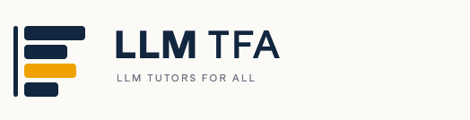

# LLM Tutors for All

  

A benchmarking framework for evaluating large language models used in education. We compare proprietary and open-weight models across response quality, cost, latency, and deployment tradeoffs, and assess AI tutor systems on their prompts, retrieval, guardrails, and educational responses. Our goal is a reproducible test suite and a set of recommendations that help instructors and developers choose the right model for their educational needs.
